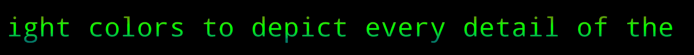
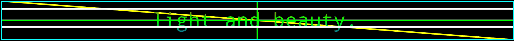
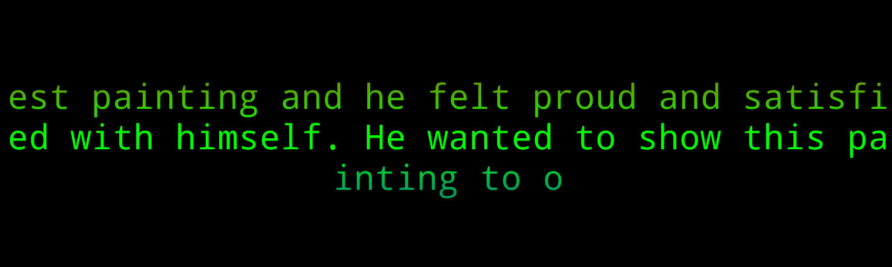
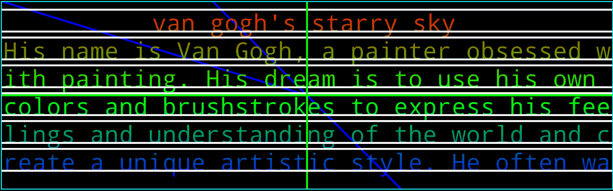
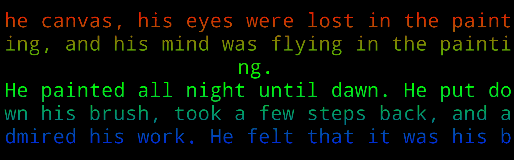
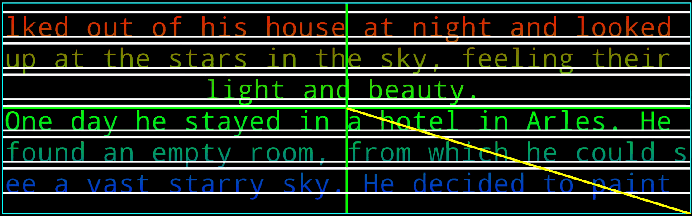
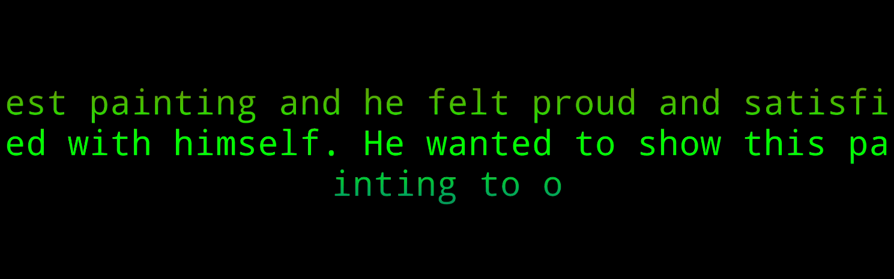
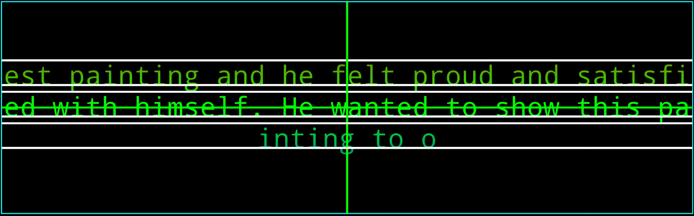

- # AttrTextLayout

-  

- ## 配置

```kotlin

// 添加MavenCentral源
repository { mavenCentral() }

// 引入远程依赖
implementation("com.kotlincrow.android.component:AttrTextLayout:1.6")
```

- ## 功能
- [x] 支持配置文本策略、样式、换行（手动、自动）、特效(擦除、移动、圆形、连续、非连续) 动画
- [x] 支持XML和动态创建
- [x] 优化绘制速度 < 3MS
- [x] 增加渐变色
- [x] 增加高刷新率动画(仅支持左右移动、上下移动、可控制速度、Speed为8时效果最佳)
- [x] 配置字体类型
- [ ] 配置渐变色RGB


- ## 效果
- 用的GIF进行录制会很卡顿，实际效果非常顺畅
- 高刷的移动速度较慢，但在像素级视图中做到了和OpenGL ES同等的效果，非常顺畅，可参考[关于高刷动画说明](#about_high_brush)

|  |  |
|:---------------------------------------:|:-----------------------------------:|
|       MoveX-HighBrushing - X轴高刷移动       |     Update-MoveX - X轴方向移动时更新文本      |

|  |  |
|:---------------------------------------:|:---------------------------------------------:|
|       MoveY-HighBrushing - Y轴高刷移动       |      MoveY-HighBrushing - Y轴高刷移动 - DEBUG      |

|  |  |
|:------------------------------------------:|:------------------------------------------------:|
|       Continuation-EraseX - X轴向左连续擦除       |      Continuation-EraseX - X轴向左连续擦除 - DEBUG      |

|  |  |
|:------------------------------------------:|:------------------------------------------------:|
|     Continuation-EraseYTop - Y轴向下连续擦除      |    Continuation-EraseYTop - Y轴向下连续擦除 - DEBUG     |

|  |  |
|:---------------------------------------:|:---------------------------------------------:|
|       Continuation-Oval - 连续圆形时钟        |      Continuation-Oval - 连续圆形时钟 - DEBUG       |

|  |  |
|:------------------------------------------:|:------------------------------------------------:|
|        Continuation-Rhombus - 连续菱形         |       Continuation-Rhombus - 连续菱形 - DEBUG        |

|  |  |
|:--------------------------------------------------:|:--------------------------------------------------------:|
|             Continuation-Oval - 连续十字扩展             |            Continuation-Oval - 连续十字扩展 - DEBUG            |

|  |  |
|:----------------------------:|:----------------------------------:|
|        Center - 中心缩放         |       Center - 中心缩放 - DEBUG        |

|  |  |
|:---------------------------------:|:---------------------------------------:|
|          Move X - X轴左向移动          |         Move X - X轴左向移动 - DEBUG         |

|  |  |
|:--------------------------------:|:--------------------------------------:|
|         Move Y - Y轴向上移动          |        Move Y - Y轴向上移动 - DEBUG         |

|  |  |
|:--------------------------:|:--------------------------------:|
|      Fade - 淡入淡出 - 异步      |     Fade - 淡入淡出 - 异步 - DEBUG     |

|  |  |
|:-------------------------------:|:-------------------------------------:|
|      Fade-Sync - 淡入淡出 - 同步      |     Fade-Sync - 淡入淡出 - 同步 - DEBUG     |

- ## 代码示例 动态创建
```kotlin
// 设置和AttrTextLayout有关的类执行动画个数 限制5个 设置0或者不设置默认不限制（防止过多视图同时执行特效卡顿）
AttrTextLayout.mAwaitAnimationCount = 5

// 创建AttrTextLayout对象
val layout = AttrTextLayout(this)

// 设置字体大小
layout.mTextSize = 14f

// 设置文本居中
layout.mTextGravity = AttrTextLayout.GRAVITY_CENTER

// 设置文本渐变方向为垂直
layout.mTextGradientDirection = AttrTextLayout.GRADIENT_VERTICAL

// 启用单行文本动画  (如果使用的是连续动画，那么很难能看出动画效果，实际上正在执行，后续优化)
layout.mSingleTextAnimationEnable = true

// 禁用多行文本
layout.mTextMultipleLineEnable = false

// 设置停留时间
layout.mTextResidenceTime = 3000

// 设置文本动画模式，这里使用的是连续X轴擦除动画
layout.mTextAnimationMode = AttrTextLayout.ANIMATION_CONTINUATION_ERASE_X

// 禁用左侧文本动画
layout.mTextAnimationLeftEnable = false

// 禁用顶部文本动画
layout.mTextAnimationTopEnable = false

// 禁用等宽字体
layout.mTextMonoSpaceEnable = false

// 禁用粗体
layout.mTextBoldEnable = false

// 禁用虚粗体
layout.mTextFakeBoldEnable = false

// 禁用抗锯齿
layout.mTextAntiAliasEnable = false

// 禁用斜体
layout.mTextItalicEnable = false

// 禁用虚斜体
layout.mTextFakeItalicEnable = false

// 设置尺寸策略为PX 或 默认
layout.mTextSizeUnitStrategy = AttrTextLayout.STRATEGY_DIMENSION_PX_OR_DEFAULT

// 设置文本渐变方向为斜向
layout.mTextGradientDirection = AttrTextLayout.GRADIENT_BEVEL

// 设置文本更新策略为全部更新
layout.mTextUpdateStrategy = AttrTextLayout.STRATEGY_TEXT_UPDATE_ALL

// 设置文本动画更新策略为连续更新
layout.mTextAnimationStrategy = AttrTextLayout.STRATEGY_ANIMATION_UPDATE_CONTINUA

// 设置行间距
layout.mTextRowMargin = 4f

// 设置字符间距 (此功能只在Android 5.0 +（API 21 +） 才支持) 
layout.mTextCharSpacing = 1f

// 设置滚动速度 最大15 最小1  -- 高刷动画 速度为8的时候 达到了高刷的最佳效果，甚至比OpenGL ES的效果看上去好了一点
layout.mTextAnimationSpeed = 13

/* 
1. 当高度为 `wrap` 只显示三行。
2. 当高度为 `match或固定高度` 并且文本刚好满足两行时，只显示两行。
*/
layout.mTextLines = 3

// 设置字体类型  Assets目录下的字体文件（mTextFontAssetsPath 的优先级大于 mTextFontAbsolutePath）
layout.mTextFontAssetsPath = "comic.ttf"

// 存储中字体文件的绝对路径
layout.mTextFontAbsolutePath = "/data/data/com.crow.attrtextlayout/files/font/calibri.ttf"

// 设置文本内容（设置后会自动更新，前提你得吧这个layout添加到您的视图里面，直到您添加完成mText也会自动生效，除非不设置）
layout.mText = "Hello World!"

```

```kotlin 策略类别
/**
 * ● 重新加载更新策略：当重新绘制的时候是否重新执行动画
 */
const val STRATEGY_ANIMATION_UPDATE_RESTART: Short = 602

/**
 * ● 默认更新策略：当重新绘制的时候继续执行已停止的动画
 */
const val STRATEGY_ANIMATION_UPDATE_CONTINUA: Short = 603

/**
 * ● PX策略 和 DP策略
 */
const val STRATEGY_DIMENSION_PX_OR_DEFAULT: Short = 604
const val STRATEGY_DIMENSION_DP_OR_SP: Short = 605

/**
 * ● 默认更新策略：当文本发生改变触发绘制需求时会直接更新绘制视图
 */
const val STRATEGY_TEXT_UPDATE_ALL: Short = 900

/**
 * ● 懒加载更新策略：当文本发生改变时 视图正在执行动画则不会更新，否则更新所有视图
 */
const val STRATEGY_TEXT_UPDATE_LAZY: Short = 901

/**
 * ● 文本更新策略：当文本发生改变时，只会更新当前视图的文本（不管动画是否停止执行都会进行更新）
 */
const val STRATEGY_TEXT_UPDATE_CURRENT: Short = 902
```

- ## 代码示例 XML
```xml
<!-- textFontAssetsPath 的优先级大于 textFontAbsolutePath -->
<com.crow.attr.text.AttrTextLayout
    android:id="@+id/attrTextLayout"
    android:layout_width="match_parent"
    android:layout_height="320dp"
    android:layout_gravity="center"
    app:singleTextAnimationEnable="true"
    app:textAnimationMode="move_x"
    app:textAnimationStrategy="continua"
    app:textAnimationX="left"
    app:textAnimationY="top"
    app:textAntiAliasEnable="true"
    app:textBoldEnable="false"
    app:textFontAssetsPath="comic.ttf"
    app:textLines="3"
    app:textFontAbsolutePath="/data/data/com.crow.attrtextlayout/files/font/calibri.ttf"
    app:textFakeBoldEnable="false"
    app:textItalicEnable="false"
    app:textCharSpacing="20dp"
    app:textColor="@color/white"
    app:textGradientDirection="vertical"
    app:textGravity="center"
    app:textMonoSpaceEnable="true"
    app:textMultipleLineEnable="true"
    app:textResidenceTime="3000"
    app:textRowMargin="1px"
    app:textAnimationSpeed="15"
    app:textSize="40sp"
    app:textSizeUnitStrategy="defaultOrSp"
    app:textUpdateStrategy="all" />
```

- ## <a id="about_high_brush"></a>关于高刷动画
```text
（1.5）版本引入了X轴高刷新率动画。在Android中，动画ValueAnimator用于完成数值A-B的匀速插值(假设0-1024)，
以实现对View的动画表现。但是，如果动画时间较快，就会导致在这个期间内0-1024不能以+1+1的形式表示，
在像素级视图中就会出现丢帧的情况。 为了实现高刷新率，可以考虑使用OpenGL ES绘制的文本，
但是性能开销十分明显。

（1.5、1.6）版本采用了协程机制为自定义View的高刷新进行了对应的处理，
也确保视图能在16MS内绘制完成而不会造成卡顿，从而实现和OpenGLES一样的效果，即不会出现丢帧。)

（1.7）版本移除了三方协程库、纯View无三方依赖

上述对纯View实现高刷的这两种实现的缺点是牺牲丢帧换来卡顿（这种情况只有在视图界面资源占用高的情况出现），
性能开销也很大，并且视图多也会卡，这点没法优化。 如果想在像素级视图中使用高刷新获得顺畅的体验，
那么可以考虑使用高刷新率动画特效，在日常使用中默认的即可。
```

- ## 参考
- [Send async messages to the Android main looper](https://github.com/Kotlin/kotlinx.coroutines/commit/8adbb70765226321bf7db485633007c6d8aba774)