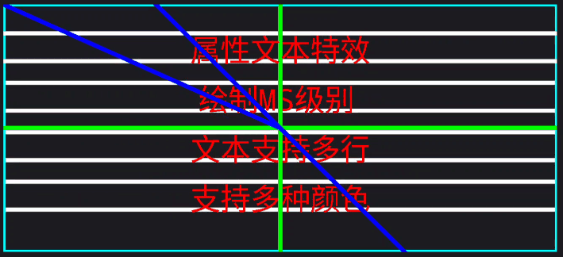

# AttrTextLayout

  

```text
1.5版本引入了X轴高刷新率动画。在Android中，动画ValueAnimator用于完成数值A-B的匀速插值(假设0-1024)，
以实现对View的动画表现。但是，如果动画时间较快，就会导致在这个期间内0-1024不能以+1+1的形式表示，
在像素级视图中就会出现丢帧的情况。 为了实现高刷新率，可以考虑使用OpenGL ES绘制的文本，
但是性能开销十分明显。因此，采用了协程机制为自定义View的高刷新进行了对应的处理，
也确保视图能在16MS内绘制完成而不会造成卡顿，从而实现和OpenGLEs一样的效果，即不会出现丢帧。
但是，这种方法的缺点是牺牲丢帧换来卡顿（这种情况只有在视图界面资源占用高的情况出现），
性能开销也很大，并且视图多也会卡，这点没法优化。 如果想在像素级视图中使用高刷新获得顺畅的体验，
那么可以考虑使用高刷新率动画特效，在日常使用中默认的即可。
```

```kotlin

// 添加MavenCentral源
repository { mavenCentral() }

// 引入远程依赖
implementation("com.kotlincrow.android.component:AttrTextLayout:1.5")
```

- [x] 配置文本策略、样式、换行、特效(擦出、移动、始终、连续动画、非连续动画)
- [x] 优化绘制速度 < 3MS
- [x] 增加渐变色


<table>
	<tr>
		<td align="center" style="padding: 10px;"></td>
		<td align="center" style="padding: 10px;"></td>
	</tr>
    <tr>
		<td align="center" style="padding: 10px;">Continuation-EraseX - X轴向左连续擦除</td>
		<td align="center" style="padding: 10px;">Continuation-EraseYTop - Y轴向上连续擦除</td>
	</tr>
</table>

<table>
	<tr>
		<td align="center" style="padding: 10px;"></td>
		<td align="center" style="padding: 10px;"></td>
	</tr>
    <tr>
		<td align="center" style="padding: 10px;">Continuation-Oval - 连续圆形时钟</td>
		<td align="center" style="padding: 10px;">Continuation-Rhombus - 连续菱形</td>
	</tr>
</table>

<table>
	<tr>
		<td align="center" style="padding: 10px;"></td>
		<td align="center" style="padding: 10px;"></td>
	</tr>
    <tr>
		<td align="center" style="padding: 10px;">Continuation-Oval - 连续十字扩展</td>
		<td align="center" style="padding: 10px;">Center - 中心缩放</td>
	</tr>
</table>

<table>
	<tr>
		<td align="center" style="padding: 10px;"></td>
		<td align="center" style="padding: 10px;"></td>
	</tr>
    <tr>
		<td align="center" style="padding: 10px;">Move Right - X轴向右移动</td>
		<td align="center" style="padding: 10px;">Move Bottom - Y轴向下移动</td>
	</tr>
</table>

<table>
	<tr>
		<td align="center" style="padding: 10px;"></td>
		<td align="center" style="padding: 10px;"></td>
	</tr>
    <tr>
		<td align="center" style="padding: 10px;">Fade - 淡入淡出_异步</td>
		<td align="center" style="padding: 10px;">Fade-Sync - 淡入淡出_同步</td>
	</tr>
</table>

---

```kotlin
// 创建AttrTextLayout对象
val layout = AttrTextLayout(this)

// 设置字体大小
layout.mTextSize = 14f

// 设置文本居中
layout.mTextGravity = AttrTextLayout.GRAVITY_CENTER

// 设置文本渐变方向为垂直
layout.mTextGradientDirection = AttrTextLayout.GRADIENT_VERTICAL

// 启用单行文本动画
layout.mSingleTextAnimationEnable = true

// 禁用多行文本
layout.mTextMultipleLineEnable = false

// 设置停留时间
layout.mTextResidenceTime = 3000

// 设置文本动画模式，这里使用的是连续X轴擦除动画
layout.mTextAnimationMode = AttrTextLayout.ANIMATION_CONTINUATION_ERASE_X

// 禁用左侧文本动画
layout.mTextAnimationLeftEnable = false

// 禁用顶部文本动画
layout.mTextAnimationTopEnable = false

// 禁用等宽字体
layout.mTextMonoSpaceEnable = false

// 禁用粗体
layout.mTextBoldEnable = false

// 禁用虚粗体
layout.mTextFakeBoldEnable = false

// 禁用抗锯齿
layout.mTextAntiAliasEnable = false

// 禁用斜体
layout.mTextItalicEnable = false

// 禁用虚斜体
layout.mTextFakeItalicEnable = false

// 设置尺寸策略为PX 或 默认
layout.mTextSizeUnitStrategy = AttrTextLayout.STRATEGY_DIMENSION_PX_OR_DEFAULT

// 设置文本渐变方向为斜向
layout.mTextGradientDirection = AttrTextLayout.GRADIENT_BEVEL

// 设置文本更新策略为全部更新
layout.mTextUpdateStrategy = AttrTextLayout.STRATEGY_TEXT_UPDATE_ALL

// 设置文本动画更新策略为连续更新
layout.mTextAnimationStrategy = AttrTextLayout.STRATEGY_ANIMATION_UPDATE_CONTINUA

// 设置行间距
layout.mTextRowMargin = 4f

// 设置字符间距
layout.mTextCharSpacing = 1f

// 设置滚动速度
layout.mTextScrollSpeed = 13

// 设置文本内容（设置后会自动更新，前提你得吧这个layout添加到您的视图里面，直到您添加完成mText也会自动生效，除非不设置）
layout.mText = "Hello World!"
```

```kotlin 策略类别
/**
 * ● 重新加载更新策略：当重新绘制的时候是否重新执行动画
 */
const val STRATEGY_ANIMATION_UPDATE_RESTART: Short = 602

/**
 * ● 默认更新策略：当重新绘制的时候继续执行已停止的动画
 */
const val STRATEGY_ANIMATION_UPDATE_CONTINUA: Short = 603

/**
 * ● PX策略 和 DP策略
 */
const val STRATEGY_DIMENSION_PX_OR_DEFAULT: Short = 604
const val STRATEGY_DIMENSION_DP_OR_SP: Short = 605

/**
 * ● 默认更新策略：当文本发生改变触发绘制需求时会直接更新绘制视图
 */
const val STRATEGY_TEXT_UPDATE_ALL: Short = 900

/**
 * ● 懒加载更新策略：当文本发生改变时 视图正在执行动画则不会更新，否则更新所有视图
 */
const val STRATEGY_TEXT_UPDATE_LAZY: Short = 901

/**
 * ● 文本更新策略：当文本发生改变时，只会更新当前视图的文本（不管动画是否停止执行都会进行更新）
 */
const val STRATEGY_TEXT_UPDATE_CURRENT: Short = 902
```

```xml
<com.crow.attr.text.AttrTextLayout
        android:id="@+id/attrTextLayout"
        android:layout_width="match_parent"
        android:layout_height="match_parent"
        app:textSize="14sp"
        app:textAnimationX="left"
        app:textAnimationY="bottom"
        app:textMonoSpaceEnable="false"
        app:textBoldEnable="false"
        app:textFakeBoldEnable="false"
        app:textAntiAliasEnable="false"
        app:textColor="@color/white"
        app:textItalicEnable="false"
        app:singleTextAnimationEnable="true"
        app:textMultipleLineEnable="false"
        app:textGravity="center"
        app:textGradientDirection="vertical"
        app:textResidenceTime="3000"
        app:textAnimationMode="move_x_high_brushing_draw"
        app:textSizeUnitStrategy="defaultOrSp"
        app:textUpdateStrategy="update_all"
        app:textAnimationStrategy="continua"
        app:textRowMargin="1px"
        app:textCharSpacing="1px"
        app:textScrollSpeed="13"
        app:text="com.crow.attr.text.AttrTextLayout -- Manually implemented by Crow" />
```